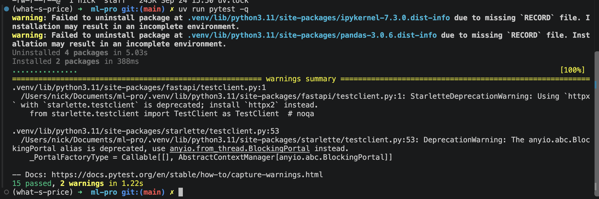
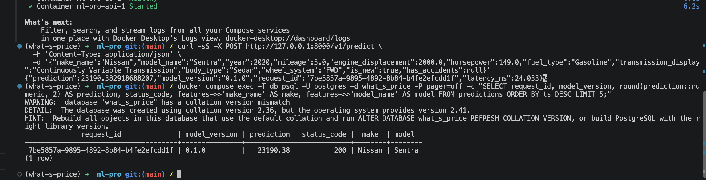
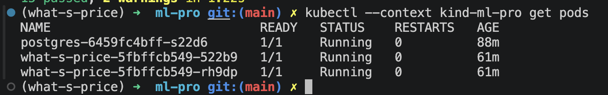
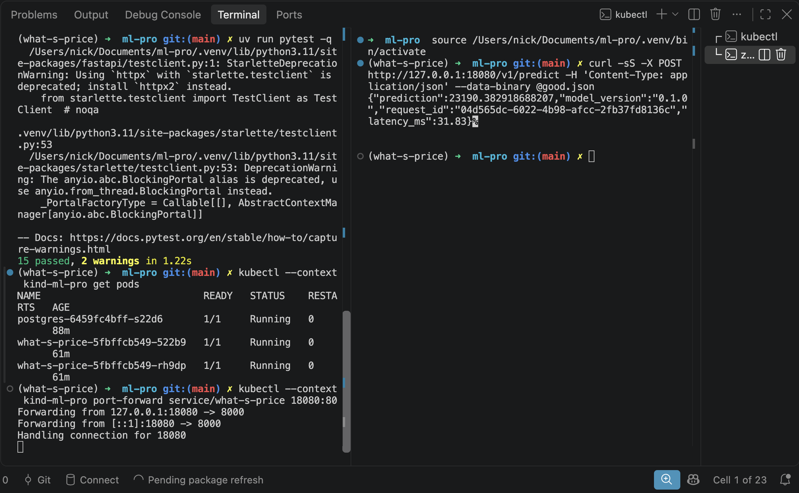
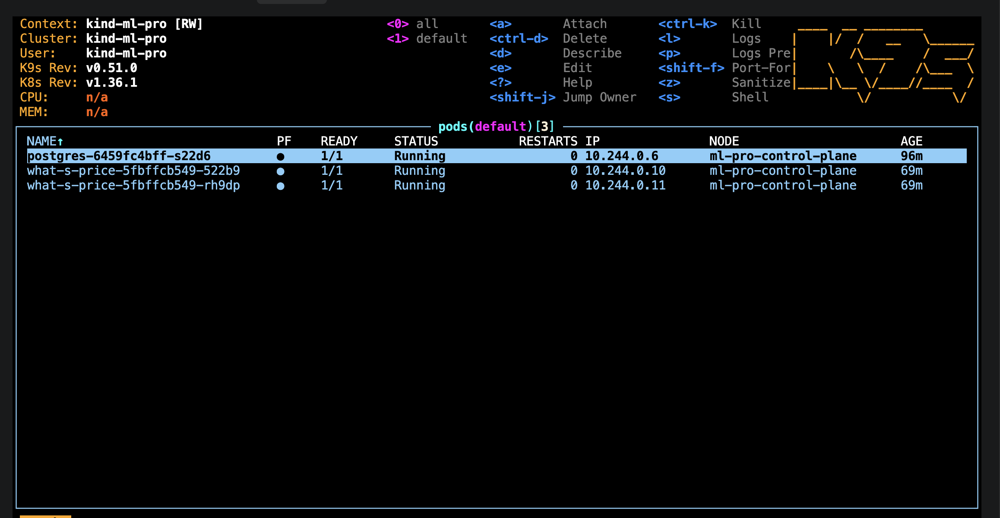

# ДЗ1. Отчёт

## Результат

Сервис оценивает цену автомобиля по 12 признакам. Модель хранится в joblib вместе с
версией и порядком признаков. API сверяет входную схему с артефактом при запуске.
PostgreSQL сохраняет запросы к `/v1/predict` со статусами `200`, `422` и `500`.

## Обязательная часть

| Проверка | Результат |
| --- | --- |
| Модель и ноутбук | Pipeline, метаданные, версия `0.1.0` и SHA-256 датасета сохранены в репозитории. |
| Окружение | Проект использует `uv`, `src`-layout и `uv.lock`. |
| API | Работают `/health`, `/ready`, `/docs` и `/v1/predict`. Лишние поля отклоняются. |
| PostgreSQL | В JSONB хранятся признаки, версия, прогноз, задержка, время и HTTP-статус. |
| Тесты | `15 passed`. |
| Docker Compose | API запускается после готовности PostgreSQL. |
| Kubernetes | В `kind` работают две реплики API, три пробы и лимиты ресурсов. Прогноз проверен через port-forward. |
| README | Проверка описана тремя командами. |

## Скриншоты

### Pytest

### PostgreSQL

### Kubernetes

### Прогноз через port-forward

### k9s

## Дополнительное задание 1. Locust

Три прогона по 60 секунд на Compose. Нагрузка включала `POST /v1/predict` и `GET /health`
с весами 5 и 1. [Итоговые CSV](docs/benchmarks/load) лежат в репозитории.

| Пользователей | RPS | Медиана, мс | p95, мс | Максимум, мс | Ошибки |
| ---: | ---: | ---: | ---: | ---: | ---: |
| 10 | 72,96 | 8 | 21 | 93,81 | 0% |
| 50 | 172,59 | 150 | 230 | 482,91 | 0% |
| 100 | 174,06 | 450 | 550 | 700,76 | 0% |

От 50 до 100 пользователей пропускная способность почти не выросла, зато p95 увеличился
с 230 до 550 мс. Ошибок не было.

## Дополнительное задание 2. Пакетный прогноз

`POST /v1/predict/batch` принимает до 1000 автомобилей за один вызов модели. На Compose
после прогрева проведено по 10 повторов. Медиана для одной машины составила 5,98 мс,
для пакета из 500 машин 6,59 мс. Пакетный запрос занял в 1,10 раза больше времени.

## Журнал проблем

| Проблема | Что выяснили | Решение |
| --- | --- | --- |
| Ноутбук не открывался. | Ядро ссылалось на старый интерпретатор. | Создали `.venv` заново и выбрали Python 3.11. |
| `uv` предупреждал о `VIRTUAL_ENV`. | Активное окружение не совпадало с ожидаемым путём. | Запустили `uv` с `--active`. |
| Тесты выводят два deprecation warning. | Предупреждения идут из FastAPI и Starlette. | Тесты проходят, предупреждения оставили видимыми. |
| PostgreSQL запускался медленно. | Docker загружал образ при первом запуске. | Повторный запуск использовал кэш. |
| PostgreSQL сообщил `collation version mismatch`. | Версии collation в сохранённом volume и образе различаются. | Запись прогнозов работает. Volume не удаляли, чтобы сохранить данные. |
| `kubectl` получил `connection refused` на `localhost:8080`. | В конфигурации не было контекста кластера. | Создали `kind-ml-pro`. |
| `pytest` не находил `what_s_price`. | Python не видел editable-путь из `.pth`. | Добавили `src` в `pythonpath` тестов. |
| `uv` сообщил об отсутствии `RECORD` у `ipykernel` и `pandas`. | Старые пакеты в локальной `.venv` установлены неполно. | `pytest` проходит. Предупреждение не влияет на контейнер. |
| Загрузка образа PostgreSQL в `kind` дала `content digest ... not found`. | Локальный образ не удалось импортировать в узел. | В кластер загружаем только образ API. |
| API pod'ы сначала перезапускались. | Deployment применили раньше секрета и готовой БД. | Скрипт сначала запускает PostgreSQL, затем API. |

Все обязательные проверки в итоге прошли.

# ДЗ2. CI/CD

## Статус

| Пункт | Подтверждение |
| --- | --- |
| Тесты с PostgreSQL | Локально: 17 passed. Ссылка на Actions появится после push. |
| Образ в GHCR и deploy в kind | Ожидает запуска на `main`. |
| Pull request: красный, затем зелёный | Ожидает отдельной пары коммитов. |
| Три поломки и исправления | Ожидают отдельных прогонов в Actions. |

## Семь вопросов

1. Время первого и второго `build` запишу из логов двух прогонов. Слой `uv sync`
   после копирования `pyproject.toml` и `uv.lock` может браться из кэша, если
   зависимости не менялись.
2. В Deployment сначала указан локальный образ `what-s-price:1.0`. CI сразу
   меняет его на образ с SHA; старые поды могут остаться с `ImagePullBackOff`,
   пока новый ReplicaSet успешно проходит rollout. Проверю это по логу deploy.
3. Пароль вводится в GitHub Actions Secret `DB_PASSWORD`, передаётся шагу
   deploy как переменная и создаёт Kubernetes Secret. Под берёт из него
   `DATABASE_URL`. ConfigMap хранится открытым текстом, поэтому пароль туда
   класть нельзя.
4. Без `needs: tests` образ может собраться из коммита с падающими тестами.
   Тогда в GHCR окажется неисправная версия сервиса.
5. На pull request запускается только `tests`: у `build` стоит условие
   `github.ref == 'refs/heads/main'`, а `deploy` зависит от `build`. Это
   оставляет публикацию образа и развёртывание для проверенного коммита в `main`.
6. `pg_advisory_xact_lock` сериализует создание таблицы при одновременном
   старте двух реплик API. Без него обе могут одновременно выполнять DDL
   на пустой базе; одна из них рискует не запуститься из-за конфликта.
7. Ожидаемый порядок: `Pending` при нехватке памяти до планирования на узел,
   `CreateContainerConfigError` при отсутствующем секрете до старта контейнера,
   `CrashLoopBackOff` при неверном пути к модели после повторных падений API.
   Сверю статусы с тремя красными прогонами.

## Журнал проблем

| Что не получилось | Как нашли причину | Как исправили |
| --- | --- | --- |
| Локальные тесты попали в другой PostgreSQL на порту 5432. | Сервер ответил `role "postgres" does not exist`; проверка порта показала второй локальный процесс. | Запустили временную базу на 55432: 17 тестов прошли. |

Ссылки на прогоны и измеренные времена добавлю после запуска Actions. Для
намеренных поломок нужны настоящие красные и следующие за ними зелёные прогоны;
результаты заранее не записываю.
